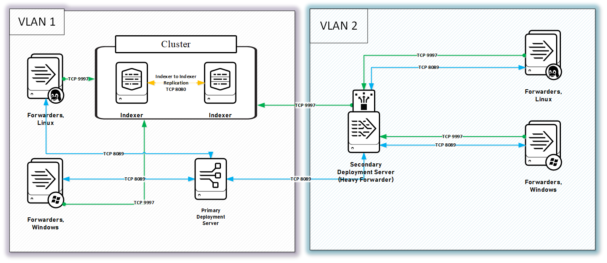

# Многоуровневый сервер развертывания Splunk
##  

Представленные файлы конфигурации позволяют развернуть многоуровневый сервер развертывания и системы передачи данных, расположенные в разных виртуальных сетях.

В этом примере мы имеем:

- Основной сервер развертывания расположенный в виртуальной сети №1
- Вторичный сервер развертывания (он же тяжелый форвардер) расположенный в виртуальной сети №2
- Универсальные серверы пересылки, действующие в качестве клиентов развертывания на основном и вторичном серверах развертывания.
- Две виртуальные сети (VLAN 1,2), в которых по соображениям безопасности порты открыты для связи и приема/отправки данных, но только для одного хоста, расположенного в VLAN 2.

## Основной сервер развертывания
Основной сервер развертывания служит главным хранилищем приложений.

В этом примере, он имеет:

#### В директории `$SPLUNK_HOME/etc/deployment-apps:`
- `send_to_secondary` (произвольное приложение для отправки данных на вторичный сервер развертывания (heavyforwarder))
- `TA-linux` (технологическое дополнение для мониторинга журналов на хостах *Nix)
- `TA_windows` (технологическое дополнение для мониторинга журналов на хостах Windows)

## Вторичный сервер развертывания
Вторичный сервер развертывания загружает свои приложения с основного сервера развертывания.

В этом примере он загрузит:

#### В директорию `$SPLUNK_HOME/etc/apps:`
- `TA-linux` (в этом примере мы используем TA-linux для локального мониторинга журналов *Nix)

#### В директорию `$SPLUNK_HOME/etc/deployment-apps:`
- `send_to_secondary`
- `TA-linux`
- `TA_windows`

## Лицензирование

[Splunk-tiered-deployment-server](https://github.com/Klimdy/Splunk-tiered-deployment-server) лицензируется в соответствии с [BEERWARE](./LICENSE) лицензией. =)

## Благодарности

[Steven Swor](https://github.com/sworisbreathing) - Человек, который первым описал похожую конфигурацию

